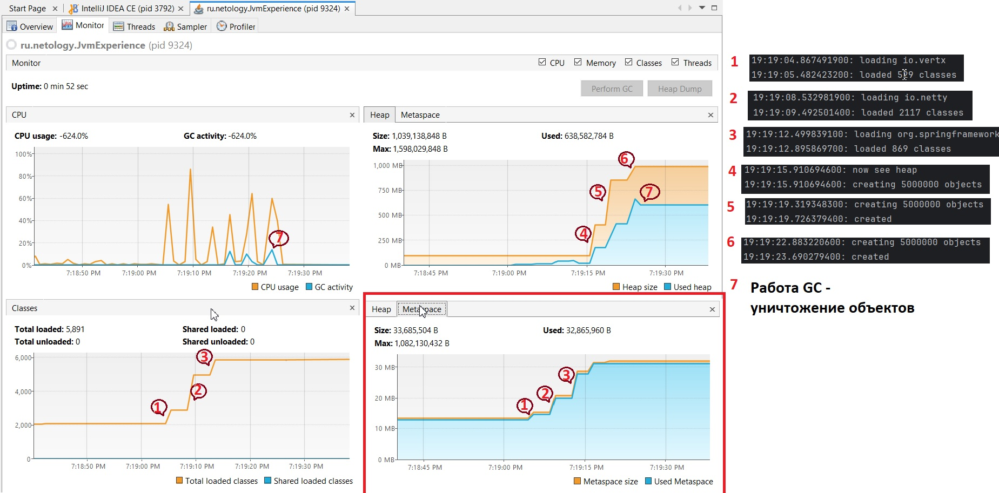

#1 - загрузка классов, увеличение объема Matespace 

#2 - загрузка классов, увеличение объема Metaspace

#3 - загрузка классов, увеличение объема Metaspace

#4 - Создание 5_000_000 объектов, увеличение объема Heap (используемого и общего)

#5 - Создание новых 5_000_000 объектов, увеличение используемого объема Heap и удвоение максимального объема Heap

#6 - Создание новых 5_000_000 объектов, увеличение только используемого объема Heap

#7 - Работа сборщика мусора, уничтожение неиспользуемых объектов, уменьшение используемого объема Heap
